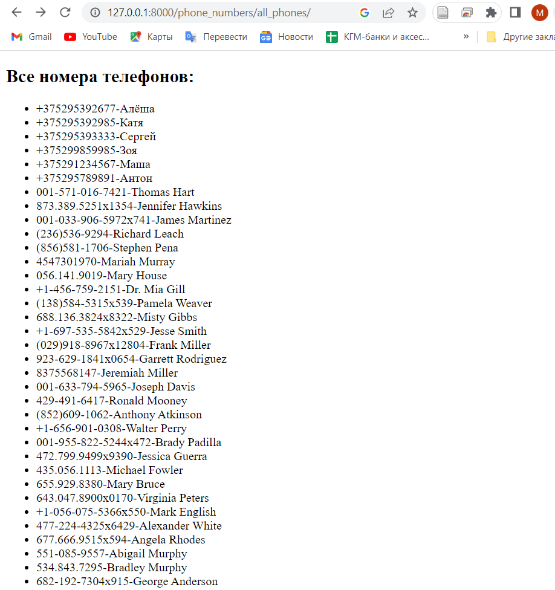
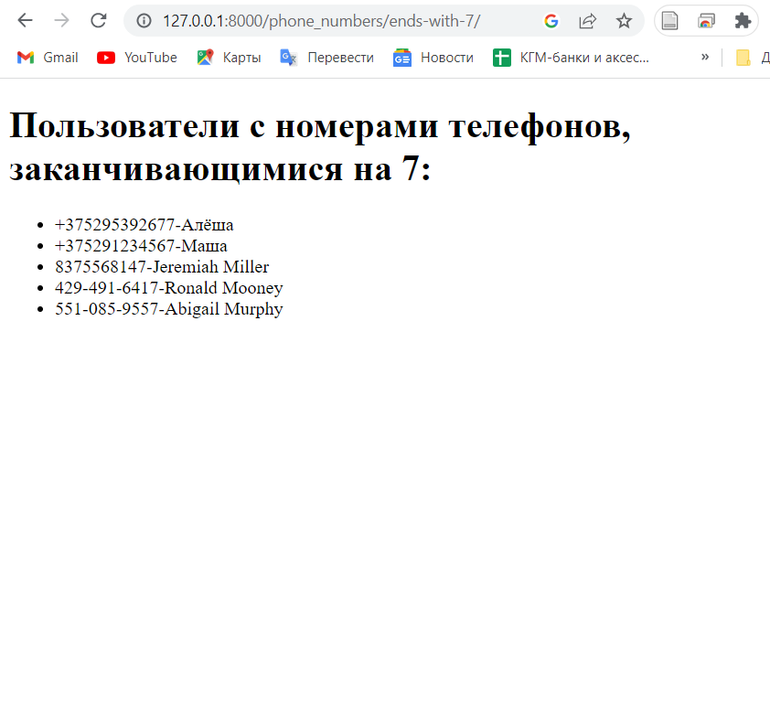
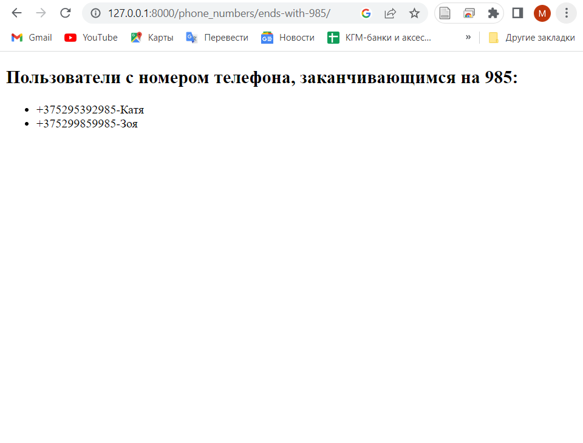

# Homework_phones
Домашка на Среду. по 22й теме.
 Если не поставили Postgres поставить.
Создать новое приложение django онлайн журнал ( Журнал номеров телефонов. С именами и телефонами
Вывести на отдельной странице Пользователей с именами у которых номер телефона заканчивается на 7 ку
Вывести на отдельной странице Пользователей с именами у которых номер телефона заканчивается на 985,
Вывести на отдельную страницу все номера телефонов)
Заполнить фэйковыми данными

